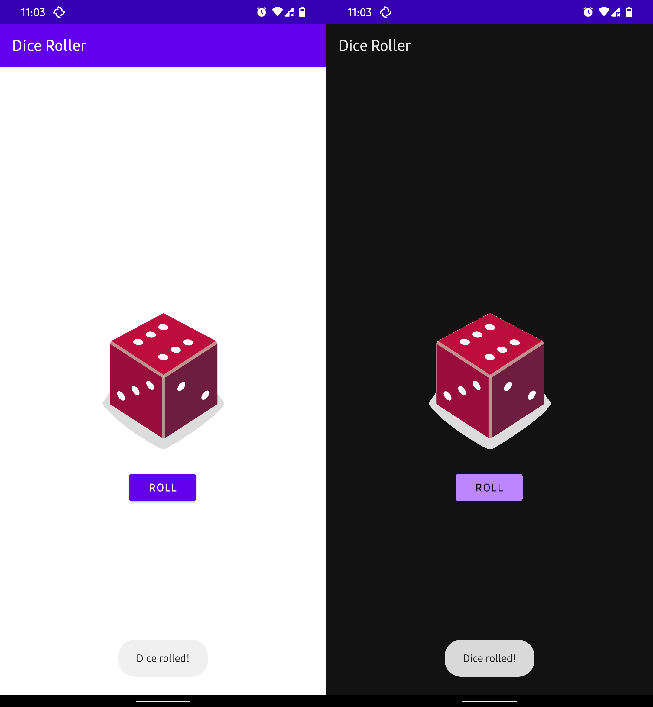

# DiceRoller
Simple android app created in Kotlin.

## What does this app do?

+ This app acts as a dice which will roll a random number from 1 to 6.
+ Android supported version: Android 5.0 and up

## That's all? You have nothing else to do?

+ Yes. This is my first android app, do not complaint.
